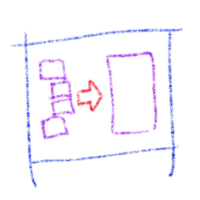

[](https://travis-ci.org/userpixel/combine-json)
[](https://github.com/userpixel/combine-json/issues)
[](http://npm.im/combine-json)
[](http://npm-stat.com/charts.html?package=combine-json&from=2017-01-01)
[](http://opensource.org/licenses/MIT)

# Combine-JSON

This module allows you to break a JSON file to a directory structure.

**Why?** Sometimes you have a huge JSON file with lots of nested objects.

* It is hard to browse to a particular section
* When using a version control system (like `git`) editing any part of the file, adds to the history of the whole file
* It is hard to understand the shape of the data structure at a glance

### Example

Given this JSON file:

##### my-data.json

```json
{
    "name": "Alex Ewerlöf",
        "address": {
        "street": "Hittepågatan 13",
        "city": "Stockholm",
        "country": "Sweden",
        "zip": "11122"
    },
    "todos": [
        {
            "id": 1,
            "title": "document the module",
        },
        {
            "id": 2,
            "title": "write some tests",
        },
        {
            "id": 3,
            "title": "publish it for good",
        }
    ]
}
```

You can break it into several files like this:

##### my-data/name.json

```json
"Alex Ewerlöf"
```

(Yes that's a perfectly valid input to `JSON.parse()`)

##### my-data/address.js

```json
{
    "street": "Hittepågatan 13",
    "city": "Stockholm",
    "country": "Sweden",
    "zip": "11122"
}
```

##### my-data/todos.js

```json
[
    {
        "id": 1,
        "title": "document the module",
    },
    {
        "id": 2,
        "title": "write some tests",
    },
    {
        "id": 3,
        "title": "publish it for good",
    }
]
```

You can write that array of objects into files as well:

##### my-data/todos/0.js

```json
{
    "id": 1,
    "title": "document the module",
}
```
##### my-data/todos/1.js

```json
{
    "id": 2,
    "title": "write some tests",
}
```
##### my-data/todos/2.js

```json
{
    "id": 3,
    "title": "publish it for good",
}
```

So the file structure looks like this:

```txt
my-data/
    |____name.json
    |____address.json
    |____todos/
        |____0.json
        |____1.json
        |____2.json
```

Of course you can have directories for array elements as well:

```txt
my-data/
    |____name.json
    |____address.json
    |____todos/
        |____0/
        |    |____id.json
        |    |____title.json
        |____1.json
        |____2.json
```

Take a look at the [`test/my-data`](./test/my-data) directory to see it in action.

# Rules

* It ignores all files that don't have a `.json` extension (case insensitive)
* For a directory to represent an array, all its contents should be consecutive numericals starting with `0`.
  Example: `./0/`, `./1/`, `./2.json`, `./3/`, ...
* The files can contain anything that `JSON.parse()` can understand: objects, arrays, strings, numbers, booleans.
* Optionally you can use [JSON5](https://www.npmjs.com/package/json5) for parsing the files.
  This means you can have comments and a liberal syntax.
  You need to explicitly install the `json5` package.

# Usage

`$ npm i combine-json`

```javascript
const { combine } = require('combine-json')

combine('path/to/roorDir').then(
    myJsonObj => console.dir(myJsonObj),
    error => console.error(error)
)
```

# API

See the [js docs](https://userpixel.github.io/combine-json/) online.

# CLI

You can use the CLI for testing what the output may look like.

```json
$ npx combine-json test/my-data/
{
    "address": {
        "street": "Hittepågatan 13",
        "city": "Stockholm",
        "country": "Sweden",
        "zip": "11122"
    },
    "name": "Alex Ewerlöf",
    "todos": [
        {
            "id": 1,
            "title": "document the module"
        },
        {
            "id": 2,
            "title": "write some tests"
        },
        {
            "id": 3,
            "title": "publish it for good"
        }
    ]
}
```

---

_Made in Sweden by [@alexewerlof](https://twitter.com/alexewerlof)_
